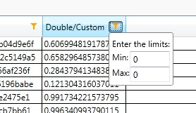

### Filtering

Filtering is enabled by simply adding one attached property to your DataGrid:
```xml
<DataGrid ItemsSource="{Binding Items}" 
          dgx:DataGridFilter.IsAutoFilterEnabled="True"/>
```
You will get a simple but efficient text or boolean filter, depending on the column type:


Every part is easily customizable by providing simple styles or templates:
```xml
<DataGridTextColumn Header="Double/Custom" 
                    Binding="{Binding Probability, Mode=OneWay}" 
                    dgx:DataGridFilterColumn.Template="{StaticResource FilterWithPopup}"/>
```
By overriding the default template you can simply create individual filters:



For further details take a tour through the code of the sample application to see the many possibilities to use and customize it.

```xml
<Window x:Class="DataGridExtensionsSample.MainWindow"
        xmlns="http://schemas.microsoft.com/winfx/2006/xaml/presentation"
        xmlns:x="http://schemas.microsoft.com/winfx/2006/xaml"
        xmlns:sys="clr-namespace:System;assembly=mscorlib"
        xmlns:src="clr-namespace:DataGridExtensionsSample"
        xmlns:dgx="clr-namespace:DataGridExtensions;assembly=DataGridExtensions"
        DataContext="{Binding RelativeSource={RelativeSource Mode=Self}}"
        Title="DataGrid Extensions Sample">
  <Window.Resources>

    <dgx:RegexContentFilterFactory x:Key="RegexContentFilterFactory"/>
    <dgx:SimpleContentFilterFactory x:Key="SimpleContentFilterFactory"/>

    <!-- Template for a simple integer dgx control. -->
    <ControlTemplate x:Key="IntegerFilter">
      <src:IntegerGreatherThanFilterControl Filter="{Binding Path=Filter, UpdateSourceTrigger=PropertyChanged, RelativeSource={RelativeSource Mode=FindAncestor, AncestorType=dgx:DataGridFilterColumnControl}}"/>
    </ControlTemplate>

    <ControlTemplate x:Key="FilterWithPopup">
      <src:FilterWithPopupControl Filter="{Binding Path=Filter, RelativeSource={RelativeSource Mode=FindAncestor, AncestorType=dgx:DataGridFilterColumnControl}}"/>
    </ControlTemplate>

  </Window.Resources>

  <Grid>
    <TabControl>

      <TabItem Header="Basic usage">
        <DockPanel>
          <TextBlock DockPanel.Dock="Top" Margin="10" TextWrapping="WrapWithOverflow">
            <Run>This tab shows the very basic usage.</Run><LineBreak/>
            <Run>Just set the IsAutoFilterEnabled property to True, and get the simple but efficient default filter.</Run>
          </TextBlock>

          <DataGrid ItemsSource="{Binding Items}" dgx:DataGridFilter.IsAutoFilterEnabled="True"/>
        </DockPanel>
      </TabItem>

      <TabItem Header="Extended 1">
        <DockPanel>
          <TextBlock DockPanel.Dock="Top" Margin="10" TextWrapping="WrapWithOverflow">
            <Run>This tab shows how to customize the filters when using auto generated columns. See the DataGrid_AutoGeneratingColumn event handler for details.</Run><LineBreak/>
            <Run>- Overrides the content filter factory to use the regex matching instead of the default simple "string contains" matching.</Run><LineBreak/>
            <Run>- Uses the sample IntergerFilter for the Index column.</Run>
          </TextBlock>
          <DataGrid ItemsSource="{Binding Items}"
              AutoGeneratingColumn="DataGrid_AutoGeneratingColumn"
              dgx:DataGridFilter.ContentFilterFactory="{StaticResource RegexContentFilterFactory}"
              dgx:DataGridFilter.IsAutoFilterEnabled="True"
              />
        </DockPanel>
      </TabItem>

      <TabItem Header="Extended 2">
        <DockPanel>
          <TextBlock DockPanel.Dock="Top" Margin="10" TextWrapping="WrapWithOverflow">
            <Run>This tab shows how to customize the filters in XAML when using explicit generated columns. Read the comments in the XAML for details.</Run><LineBreak/>
            <Run>Overrides the icon template to show an orange filter symbol.</Run>
          </TextBlock>
          <DataGrid ItemsSource="{Binding Items}" AutoGenerateColumns="False" dgx:DataGridFilter.IsAutoFilterEnabled="True">
            <DataGrid.Resources>

              <!-- Override the filter icon used in the default templates with an orange symbol; active for this grid only -->
              <ControlTemplate x:Key="{x:Static dgx:DataGridFilter.IconTemplateKey}">
                <Path Data="M0,0 L10,0 6,4 6,9 4,9 4,4 Z" Fill="Orange" VerticalAlignment="Center" HorizontalAlignment="Right" Margin="2,0"/>
              </ControlTemplate>

              <DataTemplate x:Key="CustomHeaderWithLeftAlignedSearch">
                <DockPanel>
                  <!-- The control to host the filter UI for this column -->
                  <dgx:DataGridFilterColumnControl DockPanel.Dock="Left"/>
                  <ContentPresenter x:Name="PART_Content" Content="{Binding}"
                      SnapsToDevicePixels="{Binding SnapsToDevicePixels, RelativeSource={RelativeSource Mode=FindAncestor, AncestorType=DataGridColumnHeader}}"
                      HorizontalAlignment="{Binding HorizontalContentAlignment, RelativeSource={RelativeSource Mode=FindAncestor, AncestorType=DataGridColumnHeader}}"
                      VerticalAlignment="{Binding VerticalContentAlignment, RelativeSource={RelativeSource Mode=FindAncestor, AncestorType=DataGridColumnHeader}}"/>
                </DockPanel>
              </DataTemplate>

            </DataGrid.Resources>

            <DataGrid.Columns>
              <!-- Use a check box column for the boolean property "Flag" but override the column data type to use the default text filter template; also 
                  overrides the HeaderTemplate to show customization of the filter control. -->
              <DataGridCheckBoxColumn Header="Bool/Text" HeaderTemplate="{StaticResource ResourceKey=CustomHeaderWithLeftAlignedSearch}"
                Binding="{Binding Path=Flag, Mode=OneWay}" dgx:DataGridFilterColumn.Template="{StaticResource {x:Static dgx:DataGridFilter.TextColumnFilterTemplateKey}}"/>
              <!-- Use the integer filter for the integer column. -->
              <DataGridTextColumn Header="Integer/Custom" Binding="{Binding Index, Mode=OneWay}" dgx:DataGridFilterColumn.Template="{StaticResource IntegerFilter}"/>
              <!-- Hide the filter for this column. -->
              <DataGridTextColumn Header="Text/No Filter" Binding="{Binding Column1, Mode=OneWay}" dgx:DataGridFilterColumn.IsFilterVisible="False"/>
              <!-- Use the default filter for this column. -->
              <DataGridTextColumn Header="Text/Text" Binding="{Binding Column2, Mode=OneWay}"/>
              <!-- Use a special filter using a toggle button with a popup to enter more than one condition. -->
              <DataGridTextColumn Header="Double/Custom" Binding="{Binding Probability, Mode=OneWay}" dgx:DataGridFilterColumn.Template="{StaticResource FilterWithPopup}"/>
            </DataGrid.Columns>
          </DataGrid>
        </DockPanel>
      </TabItem>

    </TabControl>

  </Grid>
</Window>
```